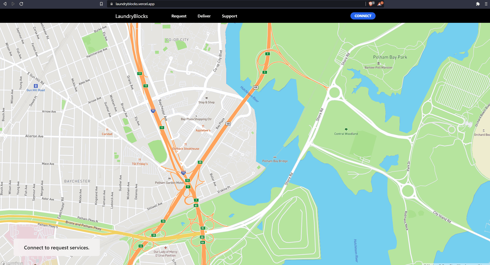

# Laundry Blocks - Web 3 Laundry Delivery App

This is a Web 3 Laundry Delivery App inspired by Uber.

## Viewing the Project

You may view the interactive project [here](https://laundryblocks.vercel.app).

## Technologies Used

- Vercel
- Amplify
- React
- TypeScript/JavaScript
- Tailwind CSS
- Next.js
- MetaMask
- Ethers.js

Notable Features:

- Working web 3 auth and wallet integration with Metamask.
- Secure ETH on-chain payments.
- Live Price Updates on location change.
- Live Map Updates based on route.
- Amplify DynamoDB Database integration.

## Learns

- How to deploy an app with vercel.
- Vercel CI/CD pipelines.
- Working with Next.js and Amplify together.
- Web 3 Auth Integration with Metamask.
- Sending and Signing ETH Transactions.
- Using Tailwind.css.

## Upcoming Additions

- Adding responsiveness for mobile device viewing.
- Driver page for accepting and recieving deliveries.
- Automatic nearby laundry location population on the map.
- Changing username and profile picture.
